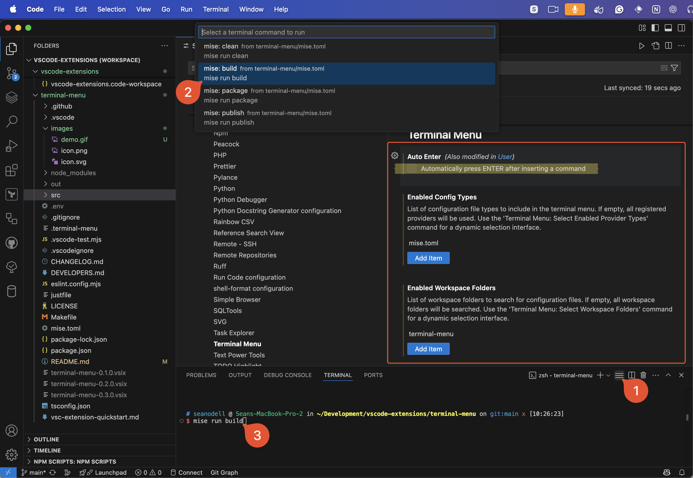

# Terminal Menu Extension

A VS Code extension that displays a menu of terminal commands from configuration files when clicked from an icon in the terminal panel. This allows users to quickly select and run commands without typing them.

## Features

- Displays commands from config files in a quick picker menu:
  - `.terminal-menu` for plain commands
  - `mise.toml` task parsing
  - `justfile` recipe parsing (ignores hidden recipes)
  - `package.json` scripts
  - `Makefile` targets (ignores internal targets)
- Shows an icon in the terminal panel for quick access
- Configurable auto-enter behavior after command selection
- Select which folders and files to load.



## Configuration Files

The extension reads commands from the following files:

### `.terminal-menu`

Create a `.terminal-menu` file in your workspace root with the following format:
```
# Comments start with #
Label for command 1: actual command to run
Label for command 2: another command to run
```

### `mise.toml`

The extension also parses `mise.toml` files to extract tasks. These tasks will appear in the terminal menu.

Example `mise.toml` format:
```toml
[tasks]
test = "npm test"
build = "npm run build"
```

### `justfile` or `Justfile`

The extension parses justfile recipes and adds them to the terminal menu. Hidden recipes (those prefixed with `@`) are ignored.

Example justfile format:
```
# Regular recipe
build:
    npm run build

# Hidden recipe (will be ignored)
@clean:
    rm -rf node_modules

# Recipe with parameters (will be included without parameters)
test arg1 arg2:
    npm test
```

### `package.json`

The extension extracts npm scripts from package.json files:

```json
{
  "name": "my-project",
  "scripts": {
    "start": "node server.js",
    "test": "jest",
    "build": "webpack"
  }
}
```

### `Makefile`, `makefile`, or `GNUmakefile`

The extension finds build targets in Makefiles. Internal targets (starting with `.`) are ignored.

```makefile
build:
	npm run build

test:
	npm test

.PHONY: all build test
```

## Extension Settings

The extension contributes the following settings:

* `terminalMenu.autoEnter`: Enable/disable automatically pressing ENTER after inserting a command (default: true)
* `terminalMenu.enabledConfigTypes`: Select which configuration file types to include in the terminal menu (default: empty, which enables all)
  * When left empty, all available providers will be used automatically
  * Specify individual providers to limit which ones are active
  * Use the command `Terminal Menu: Select Enabled Provider Types` for a dynamic selection interface
* `terminalMenu.enabledWorkspaceFolders`: Select which workspace folders to search for configuration files (default: empty, which enables all)
  * When left empty, all workspace folders will be searched
  * Specify folder names to limit which ones are searched
  * Use the command `Terminal Menu: Select Workspace Folders` for a dynamic selection interface

## Architecture

The extension uses a modular provider-based architecture:

- Each configuration file type has its own provider implementation
- All providers implement the `MenuProvider` interface
- A central registry manages all providers and handles configuration settings
- Providers can be enabled/disabled via the `terminalMenu.enabledConfigTypes` setting
- New providers can be added by implementing the `MenuProvider` interface and registering them with the registry

This modular design makes it easy to add support for additional configuration file types.

For detailed information about the architecture and how to extend it, see [DEVELOPERS.md](DEVELOPERS.md).

## Usage

1. Click the menu icon in the terminal panel
2. Select a command from the quick pick menu
3. The command will be inserted into the active terminal (and executed if auto-enter is enabled)

## Multi-root Workspace Support

When working with multi-root workspaces:

- The extension automatically searches for configuration files in all workspace folders
- Command menu items are labeled with their respective workspace folder name for easy identification
- All commands from all workspace folders are combined into a single menu
